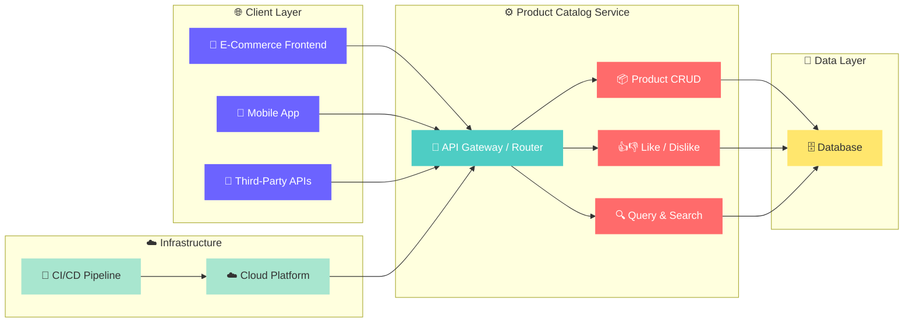
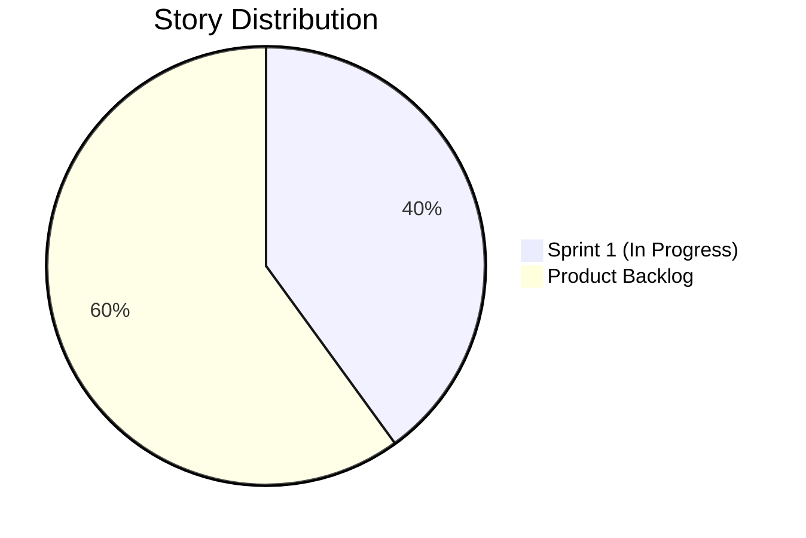
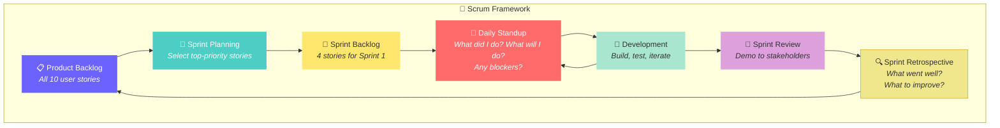

<![CDATA[<!-- ═══════════════════════════════════════════════════════════════════════════ -->
<!-- 🎨  HEADER BANNER — SVG-based hero with gradient feel                    -->
<!-- ═══════════════════════════════════════════════════════════════════════════ -->

<div align="center">

<!-- Animated typing SVG as a hero title -->
<a href="https://github.com/Sairaj213/agile-final-project">
  
</a>

<br/>

<!-- Subtle tagline -->


<br/><br/>

<!-- ── Badges Row 1: Project Metadata ── -->


<br/>

<!-- ── Badges Row 2: Tech & Methodology ── -->


<br/>

<!-- ── Divider ── -->


</div>

<br/>

<!-- ═══════════════════════════════════════════════════════════════════════════ -->
<!-- 📑  TABLE OF CONTENTS                                                     -->
<!-- ═══════════════════════════════════════════════════════════════════════════ -->

## 📑 Table of Contents

<details open>
<summary><b>Click to expand / collapse</b></summary>

<br/>

| # | Section | Description |
|:-:|:--------|:------------|
| 1 | [🎯 Project Overview](#-project-overview) | What this project is about |
| 2 | [⚡ Key Features](#-key-features) | Core product catalog capabilities |
| 3 | [🏗️ Architecture](#️-architecture) | System design & workflow |
| 4 | [📋 Product Backlog](#-product-backlog) | All 10 user stories |
| 5 | [🏃 Sprint Planning](#-sprint-planning) | Sprint breakdown & board structure |
| 6 | [🏷️ Labeling Strategy](#️-labeling-strategy) | How issues are categorized |
| 7 | [📂 Repository Structure](#-repository-structure) | File & folder layout |
| 8 | [🚀 Getting Started](#-getting-started) | How to clone & explore |
| 9 | [🔄 Agile Workflow](#-agile-workflow) | Scrum ceremonies & practices |
| 10 | [🤝 Contributing](#-contributing) | How to contribute |
| 11 | [📜 License](#-license) | License information |

</details>

<br/>

<!-- ═══════════════════════════════════════════════════════════════════════════ -->
<!-- 🎯  PROJECT OVERVIEW                                                      -->
<!-- ═══════════════════════════════════════════════════════════════════════════ -->

## 🎯 Project Overview

> **This repository demonstrates the practical application of Agile and Scrum methodologies** to plan, track, and manage the development of a **back-end product catalog service** for an e-commerce platform.

The project focuses on **project management artifacts** rather than code implementation — showcasing how a real-world development team would use GitHub's built-in tools (Issues, Projects, Milestones, Labels) to run an Agile sprint from inception to delivery.

### 🧩 What This Project Demonstrates

```
┌─────────────────────────────────────────────────────────────────┐
│                                                                 │
│   ✅  Writing well-structured User Stories (As a / I need /     │
│       So that) with Acceptance Criteria in Gherkin syntax       │
│                                                                 │
│   ✅  Building & managing a Product Backlog with GitHub Issues  │
│                                                                 │
│   ✅  Sprint Planning using GitHub Milestones                   │
│                                                                 │
│   ✅  Kanban board management via GitHub Projects               │
│                                                                 │
│   ✅  Labeling & categorization strategy (enhancement,          │
│       technical debt)                                           │
│                                                                 │
│   ✅  Issue templates for consistent story creation             │
│                                                                 │
└─────────────────────────────────────────────────────────────────┘
```

<br/>

<!-- ═══════════════════════════════════════════════════════════════════════════ -->
<!-- ⚡  KEY FEATURES                                                          -->
<!-- ═══════════════════════════════════════════════════════════════════════════ -->

## ⚡ Key Features

The product catalog service is designed to support the following **RESTful operations**:

<table>
<tr>
<td width="50%">

### 🛍️ Customer-Facing

| Operation | Description |
|:----------|:------------|
| 📖 **List Products** | Browse all available catalog items |
| 🔍 **Query Products** | Search by category, price, keywords |
| 📄 **Retrieve Product** | View full details by product ID |
| 👍 **Like Product** | Express preference for an item |
| 👎 **Dislike Product** | Indicate a product didn't meet expectations |

</td>
<td width="50%">

### 🔧 Admin & Infrastructure

| Operation | Description |
|:----------|:------------|
| ➕ **Create Product** | Add new items to the catalog |
| ✏️ **Update Product** | Modify price, description, inventory |
| 🗑️ **Delete Product** | Remove discontinued products |
| ☁️ **Cloud Hosting** | High availability & elasticity |
| 🔄 **CI/CD Pipeline** | Automated build, test, deploy |

</td>
</tr>
</table>

<br/>

<!-- ═══════════════════════════════════════════════════════════════════════════ -->
<!-- 🏗️  ARCHITECTURE                                                         -->
<!-- ═══════════════════════════════════════════════════════════════════════════ -->

## 🏗️ Architecture



<br/>

<!-- ═══════════════════════════════════════════════════════════════════════════ -->
<!-- 📋  PRODUCT BACKLOG                                                       -->
<!-- ═══════════════════════════════════════════════════════════════════════════ -->

## 📋 Product Backlog

The backlog contains **10 user stories** organized by stakeholder role. Each story follows the standard format and includes acceptance criteria.

---

### 🛍️ Customer / Shopper Stories

<details>
<summary><b>📄 #1 — Create a product in the catalog</b></summary>

<br/>

| Field | Details |
|:------|:--------|
| **Role** | Catalog Administrator |
| **Label** | `enhancement` |
| **Sprint** | ✅ Sprint 1 |
| **Assignee** | @Sairaj213 |

> **As a** catalog administrator  
> **I need** the ability to create a product in the catalog  
> **So that** new items can be added and made available for customers to view and purchase

**Acceptance Criteria:**
```gherkin
Given the catalog administrator has valid product details (name, description, price, sku)
When the administrator submits the new product to the catalog
Then the product is stored successfully in the database
And a confirmation with the new product ID and HTTP 201 status is returned
```

</details>

<details>
<summary><b>🔍 #2 — Retrieve a product from the catalog</b></summary>

<br/>

| Field | Details |
|:------|:--------|
| **Role** | Customer / Client Application |
| **Label** | `enhancement` |
| **Sprint** | ✅ Sprint 1 |
| **Assignee** | @Sairaj213 |

> **As a** customer or client application  
> **I need** the ability to retrieve a product from the catalog  
> **So that** I can view complete details, specifications, and pricing for a specific item

**Acceptance Criteria:**
```gherkin
Given a product exists in the catalog with a valid product ID
When a request is submitted to retrieve the product by its ID
Then the product details are returned with HTTP 200 status
And if the product does not exist, an error response with HTTP 404 status is returned
```

</details>

<details>
<summary><b>✏️ #3 — Update a product in the catalog</b></summary>

<br/>

| Field | Details |
|:------|:--------|
| **Role** | Catalog Administrator |
| **Label** | `enhancement` |
| **Sprint** | ✅ Sprint 1 |
| **Assignee** | @Sairaj213 |

> **As a** catalog administrator  
> **I need** the ability to update a product in the catalog  
> **So that** product information such as price, description, or inventory stays up to date

**Acceptance Criteria:**
```gherkin
Given an existing product in the catalog
When the administrator submits modified product details
Then the product record is updated in the catalog
And the updated details are returned with HTTP 200 status
```

</details>

<details>
<summary><b>🗑️ #4 — Delete a product from the catalog</b></summary>

<br/>

| Field | Details |
|:------|:--------|
| **Role** | Catalog Administrator |
| **Label** | `enhancement` |
| **Sprint** | ✅ Sprint 1 |
| **Assignee** | @Sairaj213 |

> **As a** catalog administrator  
> **I need** the ability to delete a product from the catalog  
> **So that** discontinued or obsolete products can be permanently removed

**Acceptance Criteria:**
```gherkin
Given an existing product in the catalog
When the administrator requests deletion of the product
Then the product is permanently removed from the catalog
And an HTTP 204 No Content response is returned
```

</details>

<details>
<summary><b>👍 #5 — Like a product in the catalog</b></summary>

<br/>

| Field | Details |
|:------|:--------|
| **Role** | Customer / Shopper |
| **Label** | `enhancement` |
| **Sprint** | 📌 Backlog |

> **As a** customer / shopper  
> **I need** the ability to Like a product in the catalog  
> **So that** I can indicate my preference and help other shoppers discover popular items

**Acceptance Criteria:**
```gherkin
Given a customer is browsing a product page
When the customer clicks the 'Like' button on a product
Then the like count for the product increments by 1
And the customer's like status is saved
```

</details>

<details>
<summary><b>👎 #6 — Dislike a product in the catalog</b></summary>

<br/>

| Field | Details |
|:------|:--------|
| **Role** | Customer / Shopper |
| **Label** | `enhancement` |
| **Sprint** | 📌 Backlog |

> **As a** customer / shopper  
> **I need** the ability to Dislike a product in the catalog  
> **So that** I can express that a product did not meet my expectations

</details>

<details>
<summary><b>📖 #7 — List all products in the catalog</b></summary>

<br/>

| Field | Details |
|:------|:--------|
| **Role** | Customer / Shopper |
| **Label** | `enhancement` |
| **Sprint** | 📌 Backlog |

> **As a** customer / shopper  
> **I need** the ability to list all products in the catalog  
> **So that** I can browse through all available items in the store

</details>

<details>
<summary><b>🔎 #8 — Query a subset of products in the catalog</b></summary>

<br/>

| Field | Details |
|:------|:--------|
| **Role** | Customer / Shopper |
| **Label** | `enhancement` |
| **Sprint** | 📌 Backlog |

> **As a** customer / shopper  
> **I need** the ability to query a subset of products in the catalog  
> **So that** I can find specific items by category, price range, or search keywords

</details>

---

### 🔧 DevOps / Infrastructure Stories

<details>
<summary><b>☁️ #9 — Must be hosted in the cloud</b></summary>

<br/>

| Field | Details |
|:------|:--------|
| **Role** | DevOps Engineer |
| **Label** | `technical debt` |
| **Sprint** | 📌 Backlog |

> **As a** DevOps engineer  
> **I need** the product catalog service to be hosted in the cloud  
> **So that** the application has high availability, elasticity, and reliable infrastructure

</details>

<details>
<summary><b>🔄 #10 — Must have automation to deploy new changes to the cloud</b></summary>

<br/>

| Field | Details |
|:------|:--------|
| **Role** | Developer / DevOps Engineer |
| **Label** | `technical debt` |
| **Sprint** | 📌 Backlog |

> **As a** developer / DevOps engineer  
> **I need** automation to deploy new changes to the cloud  
> **So that** updates can be built, tested, and released continuously with minimal downtime and error

</details>

<br/>

<!-- ═══════════════════════════════════════════════════════════════════════════ -->
<!-- 🏃  SPRINT PLANNING                                                       -->
<!-- ═══════════════════════════════════════════════════════════════════════════ -->

## 🏃 Sprint Planning

### Sprint 1 Overview

| Attribute | Value |
|:----------|:------|
| 🏷️ **Milestone** | `Sprint` |
| ⏱️ **Duration** | 2 weeks |
| 📅 **Due Date** | September 20, 2026 |
| 📊 **Stories in Sprint** | 4 |
| 📌 **Stories in Backlog** | 6 |

### 📊 Sprint vs Backlog Distribution



### 🗂️ Kanban Board Columns

The project uses a **GitHub Projects Kanban board** with the following workflow:

```mermaid
graph LR
    A["📥 New Issues"]
    B["📝 Icebox"]
    C["📋 Product Backlog"]
    D["🏃 Sprint Backlog"]
    E["🔨 In Progress"]
    F["👀 Review / QA"]
    G["✅ Done"]

    A --> B
    B --> C
    C --> D
    D --> E
    E --> F
    F --> G

    style A fill:#E8E8E8,stroke:#999,color:#333
    style B fill:#DDD6FE,stroke:#8B5CF6,color:#333
    style C fill:#BFDBFE,stroke:#3B82F6,color:#333
    style D fill:#FDE68A,stroke:#F59E0B,color:#333
    style E fill:#FCA5A5,stroke:#EF4444,color:#333
    style F fill:#A7F3D0,stroke:#10B981,color:#333
    style G fill:#6EE7B7,stroke:#059669,color:#fff
```



### 📌 Sprint 1 — Story Assignment

| # | Story | Assignee | Status |
|:-:|:------|:---------|:------:|
| 1 | Create a product in the catalog | @Sairaj213 | 🔨 In Progress |
| 2 | Retrieve a product from the catalog | @Sairaj213 | 🔨 In Progress |
| 3 | Update a product in the catalog | @Sairaj213 | 🔨 In Progress |
| 4 | Delete a product from the catalog | @Sairaj213 | 🔨 In Progress |

<br/>

<!-- ═══════════════════════════════════════════════════════════════════════════ -->
<!-- 🏷️  LABELING STRATEGY                                                    -->
<!-- ═══════════════════════════════════════════════════════════════════════════ -->

## 🏷️ Labeling Strategy

Issues are categorized using a clear labeling system to distinguish between feature work and infrastructure concerns:

| Label | Color | Purpose | Count |
|:------|:-----:|:--------|:-----:|
|  | 🟦 | New feature or request | **8** |
|  | 🟥 | Technical debt or infrastructure items | **2** |
|  | 🔴 | Something isn't working | — |
|  | 🔵 | Improvements or additions to docs | — |
|  | 🟣 | Good for newcomers | — |

<br/>

<!-- ═══════════════════════════════════════════════════════════════════════════ -->
<!-- 📂  REPOSITORY STRUCTURE                                                  -->
<!-- ═══════════════════════════════════════════════════════════════════════════ -->

## 📂 Repository Structure

```
agile-final-project/
│
├── 📄 README.md                          # Project documentation (you are here!)
│
└── 📁 .github/
    └── 📁 ISSUE_TEMPLATE/
        └── 📄 user-story.md              # User Story issue template
                                           #   ├── As a [role]
                                           #   ├── I need [function]
                                           #   ├── So that [benefit]
                                           #   └── Acceptance Criteria
```

> 💡 **Note:** This project focuses on **Agile planning artifacts** (user stories, sprint planning, backlog management) rather than application source code.

<br/>

<!-- ═══════════════════════════════════════════════════════════════════════════ -->
<!-- 🚀  GETTING STARTED                                                       -->
<!-- ═══════════════════════════════════════════════════════════════════════════ -->

## 🚀 Getting Started

### 📥 Clone the Repository

```bash
git clone https://github.com/Sairaj213/agile-final-project.git
cd agile-final-project
```

### 👀 Explore the Agile Artifacts

| What to Explore | Where to Find It |
|:----------------|:-----------------|
| 📋 **Product Backlog** | [Issues Tab](https://github.com/Sairaj213/agile-final-project/issues) |
| 📊 **Kanban Board** | [Projects Tab](https://github.com/Sairaj213/agile-final-project/projects) |
| 🏃 **Sprint Milestone** | [Milestones](https://github.com/Sairaj213/agile-final-project/milestones) |
| 🏷️ **Labels** | [Labels](https://github.com/Sairaj213/agile-final-project/labels) |
| 📝 **Issue Template** | [`.github/ISSUE_TEMPLATE/user-story.md`](https://github.com/Sairaj213/agile-final-project/blob/main/.github/ISSUE_TEMPLATE/user-story.md) |

<br/>

<!-- ═══════════════════════════════════════════════════════════════════════════ -->
<!-- 🔄  AGILE WORKFLOW                                                        -->
<!-- ═══════════════════════════════════════════════════════════════════════════ -->

## 🔄 Agile Workflow

This project follows the **Scrum framework** with the following ceremonies and artifacts:



### 📝 User Story Template

Every story follows a standardized template:

```
As a    → [role]           — Who benefits?
I need  → [function]       — What capability?
So that → [benefit]        — Why does it matter?

Acceptance Criteria        — Gherkin-style Given/When/Then
```

<br/>

<!-- ═══════════════════════════════════════════════════════════════════════════ -->
<!-- 🤝  CONTRIBUTING                                                          -->
<!-- ═══════════════════════════════════════════════════════════════════════════ -->

## 🤝 Contributing

Contributions are welcome! Here's how you can help:

1. **🍴 Fork** the repository
2. **🌿 Create** a feature branch (`git checkout -b feature/amazing-feature`)
3. **💾 Commit** your changes (`git commit -m 'Add amazing feature'`)
4. **📤 Push** to the branch (`git push origin feature/amazing-feature`)
5. **🔃 Open** a Pull Request

> 📌 Please use the [User Story template](https://github.com/Sairaj213/agile-final-project/blob/main/.github/ISSUE_TEMPLATE/user-story.md) when creating new issues.

<br/>

<!-- ═══════════════════════════════════════════════════════════════════════════ -->
<!-- 📜  LICENSE                                                               -->
<!-- ═══════════════════════════════════════════════════════════════════════════ -->

## 📜 License

This project is open source and available for educational purposes.

<br/>

<!-- ═══════════════════════════════════════════════════════════════════════════ -->
<!-- 🙏  ACKNOWLEDGMENTS                                                       -->
<!-- ═══════════════════════════════════════════════════════════════════════════ -->

## 🙏 Acknowledgments

<table>
<tr>
<td>📚</td>
<td><b>IBM DevOps and Software Engineering Professional Certificate</b></td>
</tr>
<tr>
<td>🎓</td>
<td><b>Coursera — Agile Development and Scrum</b></td>
</tr>
<tr>
<td>🛠️</td>
<td><b>GitHub</b> — for Issues, Projects, Milestones & Labels</td>
</tr>
</table>

<br/>

<!-- ═══════════════════════════════════════════════════════════════════════════ -->
<!-- FOOTER                                                                    -->
<!-- ═══════════════════════════════════════════════════════════════════════════ -->

<div align="center">


<br/>

**⭐ If you found this project helpful, please give it a star!**

<br/>

Made with ❤️ by [Sairaj213](https://github.com/Sairaj213)

<br/>

[](https://github.com/Sairaj213)
[](https://github.com/Sairaj213/agile-final-project)

</div>
